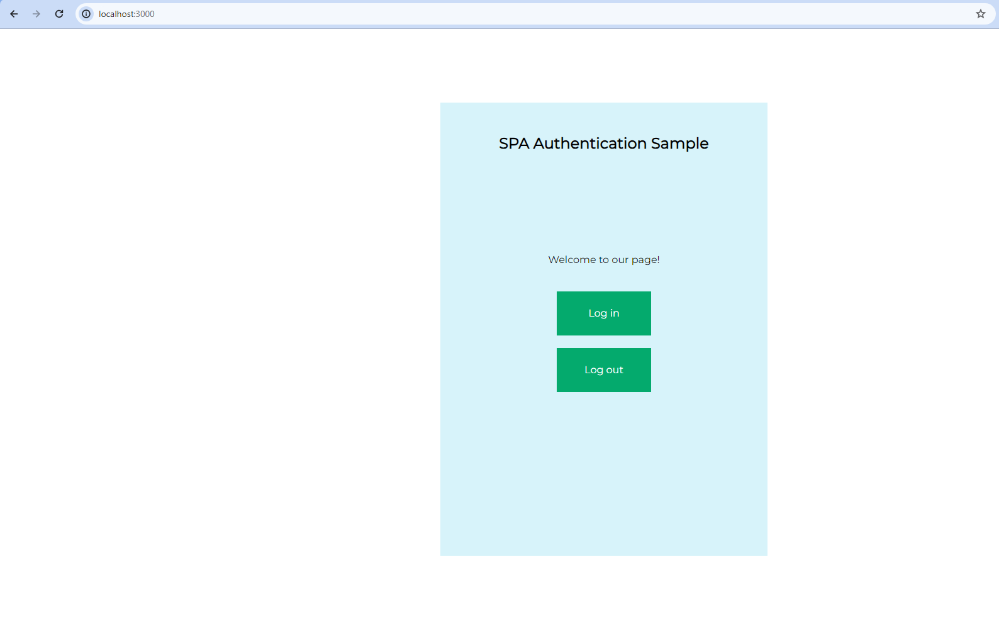
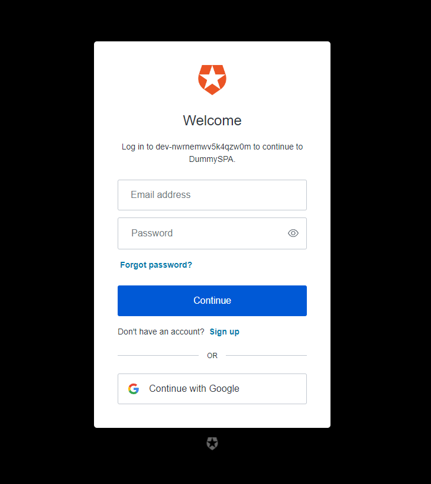
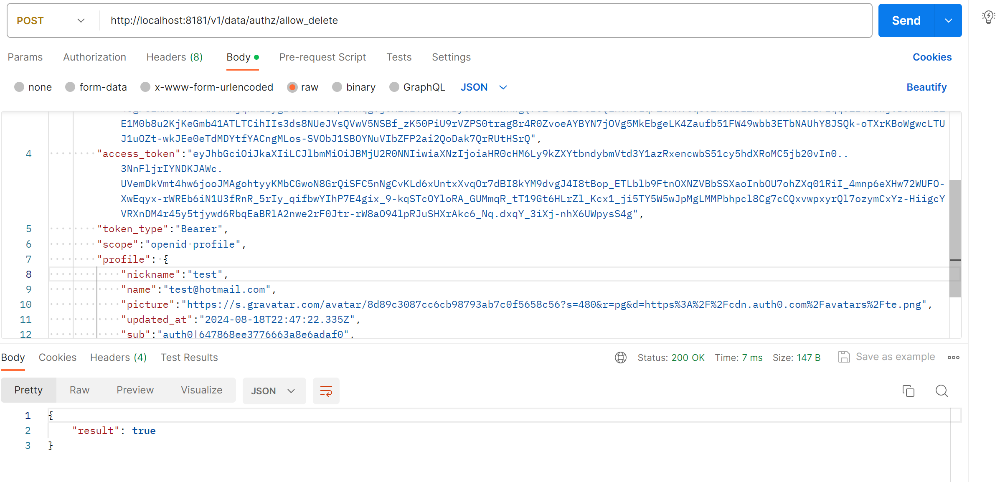
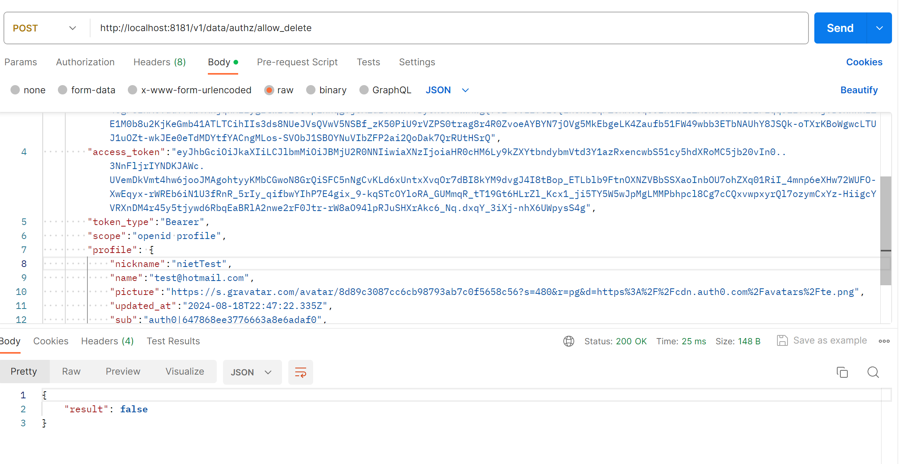

# Cyber Security Advanced - Opdracht 3
*Auteur: Dion Brovina*

## Intro
Een SPA waarin we kunnen aanmelden en onszelf authoriseren. We kunnen op deze applicatie inloggen, daarbij krijgen we meer informatie te zien. Als we uitloggen verdwijnt deze informatie die ons werd toevertrouwd weer.

## Threat Model

## Uitwerking
We starten de applicatie en openen de browser op http://localhost:3000

    docker compose up --build

### Login 

---
Op deze pagina kunnen we inloggen met behulp van Auth0

--- 

Bij het inloggen krijgen we een token te zien op onze homepagina

    eyJhbGciOiJkaXIiLCJlbmMiOiJBMjU2R0NNIiwiaXNzIjoiaHR0cHM6Ly9kZXYtbndybmVtd3Y1azRxencwbS51cy5hdXRoMC5jb20vIn0..P4X85PL66H8SuHUT.KxOHXC5P1CcxFAirjJcLCWrBEO02-izG6hTfCJyqYhMCOsePU4MB5ds4jSN2hIiukpqrovjK4R8IPbMOKlmiN1nIwjX5UwYZ2JEKlnDfJd_WmpX1bPcYUZmeanKpFlHNALB860idmBQq81ZPTgaW4ksZQpfNvv38LDxHAhuDH258rSOKuwqKQkdxroXcemHneRfx0zy0BW9uPjHgg_6eTXQzEQbj78ZXFtuQrHmtWm-Aq8JQebtLkhEfbgSu8EJOQRZsipofE3BgPTbpZIUZpNnfE_P8Ik2DiaB7UK_n_8qlR3ce109IOWLO2AhVH73AzbHlM4n7g3Hzp3M3.PbEhQ1-V-YpPSvVNVpIrVg

    {"nickname":"wexis39086","name":"wexis39086@eachart.com","picture":"https://s.gravatar.com/avatar/2195de3a1a9d69a3d506edf0a6267e22?s=480&r=pg&d=https%3A%2F%2Fcdn.auth0.com%2Favatars%2Fwe.png","updated_at":"2023-11-19T20:43:18.890Z","sub":"auth0|655a1b165aafe8e87428491d","sid":"gAu0LDia_fSDYPwwY9mpp2vqIZ6IigYT"}

### oidc-client
Om naar Auth0 te verwijzen wordt er gerbuik gemaakt van oidc-client, bij een gebruiker die is ingelogd kunnen we meerdere gegevens tonen over deze gebruiker.

    oidcClient = new Oidc.UserManager(oidcConfig);

    const updateUI = async () => {
        const isAuthenticatedOIDC = await oidcClient.getUser();

        document.getElementById("btn-logout").disabled = !isAuthenticatedOIDC;
        document.getElementById("btn-login").disabled = isAuthenticatedOIDC;

        // Show/hide gated content after authentication
        if (isAuthenticatedOIDC) {
            document.getElementById("gated-content").classList.remove("hidden");

            // Display information from OIDC
            const user = await oidcClient.getUser();
            document.getElementById("ipt-access-token").innerHTML = user.access_token;
            document.getElementById("ipt-user-profile").textContent = JSON.stringify(user.profile);
            // You can customize the display of user information here

        } else {
            document.getElementById("gated-content").classList.add("hidden");
        }
    };

### Logout
Om ons uit te loggen maken we gerbuik van "end_session_endpoint", deze link stuurt ons naar auth0 en logt ons uit waarna het ons terug naar localhost verwijst.

    "end_session_endpoint": "https://dev-nwrnemwv5k4qzw0m.us.auth0.com/logout?client_id=AguPJO5FklsMz75dYqVcVngnbKo7nnPB&returnTo=http://localhost:3000/"

### Docker-compose
De docker compose file zet de OPA policy op en de applicatie

    version: '3'

    services:
    api:
        build:
        context: .
        dockerfile: ./Dockerfile
        ports:
        - "3000:3000"

    opa:
        image: openpolicyagent/opa:latest
        ports:
        - "8181:8181"
        volumes:
        - ./policy.rego:/config/policy.rego
        command:
        - "run"
        - "--server"
        - "--addr=:8181"
        - "/config/policy.rego"
---

    package authz

    default allow_delete = false

    allow_delete {
        input.profile.nickname == "test"
    }

In onze policy.rego staan de regels die zullen bepalen of de gebruiker word toegelaten om een item te verwijderen. In dit voorbeeld kan enkel een gebruiker met de naam test een item verwijderen bijvoorbeeld. Het uitvoeren van de volledige code loopt mis omdat ik het CORS probleem niet op tijd krijg opgelost. Maar via een postman request kunnen we zien dat de gebruiker test wel de actie mag uitvoeren maar een andere gebruiker niet.

## Conclusie
---
We hebben een SPA applicatie gemaakt die gebruik maakt van Auth0 door middel van OIDC, dit maakt de code veel flexibeler. We kunnen elk moment wisselen van identity provider door enkele variabelen te verandern in .env files. De applicatie controleert welke gebruikers zijn ingelogd en een administrator kan via Auth0 meer rechten geven aan gebruikers. Als gerbuikers de juiste naam hebben in mijn voorbeeld kunnen ze de derde knop gebruiken omdat dit word gecontroleerd door de Open Policy Agent alhoewel ik dit niet werkende heb gekregen.
